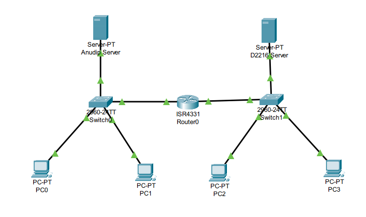

# Multi-Domain Network Infrastructure Project
## DNS and DHCP Implementation for Anudip.in and D2216.com

### 1. Project Overview
This project demonstrates the implementation of a routed enterprise network using Cisco Packet Tracer. The design connects two geographically or logically separate offices (Anudip and D2216) through a central router. The infrastructure automates network configuration via DHCP and provides domain name resolution via DNS.

### 2. Network Topology
The network utilizes a Star-Bus hybrid architecture:
* **Router (ISR4331):** Serves as the Layer 3 backbone connecting two distinct subnets.
* **Switches (2960-24TT):** Manage Local Area Network (LAN) traffic for each office.
* **Servers:** Dedicated nodes hosting HTTP, DNS, and DHCP services for their respective domains.
* **Workstations (PCs):** End devices configured to receive dynamic addressing.

### 3. Network Configuration Table
| Device | Network | IP Address | Subnet Mask | Default Gateway |
| :--- | :--- | :--- | :--- | :--- |
| Router (Left) | Anudip | 192.168.10.1 | 255.255.255.0 | N/A |
| Router (Right) | D2216 | 192.168.20.1 | 255.255.255.0 | N/A |
| Server 0 | Anudip | 192.168.10.2 | 255.255.255.0 | 192.168.10.1 |
| Server 1 | D2216 | 192.168.20.2 | 255.255.255.0 | 192.168.20.1 |

### 4. Service Implementation

#### DHCP (Dynamic Host Configuration Protocol)
Automated IP addressing is configured on both servers to manage client pools.
* **Pool Start IP:** 192.168.x.10
* **Included Parameters:** Subnet Mask, Default Gateway, and DNS Server IP.
* **Objective:** To eliminate manual configuration errors and ensure all devices have the correct gateway to reach external networks.

#### DNS (Domain Name System)
Name resolution is synchronized across both offices to allow cross-domain communication.
* **Record 1:** anudip.in -> 192.168.10.2
* **Record 2:** d2216.com -> 192.168.20.2

#### HTTP (Web Service)
Customized HTML landing pages are hosted on each server to provide visual confirmation of successful routing and name resolution.

### 5. Installation and Setup Steps
1. **Physical Cabling:** Connect devices using Copper Straight-Through cables. End devices and servers connect to switches; switches connect to the ISR4331 router via GigabitEthernet ports.
2. **Gateway Configuration:** Enable router interfaces via CLI and assign the respective Gateway IPs for each subnet.
3. **Server Static Setup:** Manually assign IPs to Server 0 and Server 1 to ensure service stability.
4. **Service Activation:** Enable DNS and DHCP services. Crucially, update both the "serverPool" and any custom pools with the correct Default Gateway.
5. **Client Verification:** Use the "ipconfig /renew" command on PCs to pull the updated network parameters.

### 6. Verification Methods
* **Connectivity:** Execute "ping" commands from one subnet to the server of the other subnet.
* **Path Resolution:** Perform "nslookup" or use the Web Browser tool to navigate to the domains "anudip.in" and "d2216.com".
* **Configuration Check:** Use "ipconfig /all" to ensure the Default Gateway is not 0.0.0.0.

---
**Project built by:** Divyansh Mishra
**Environment:** Cisco Packet Tracer 8.x